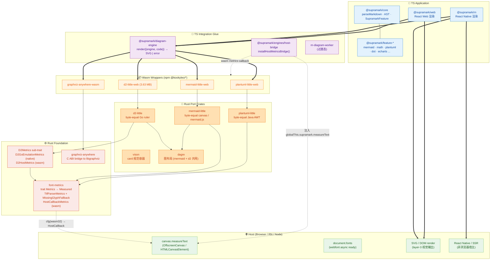

# Supramark 项目结构与依赖关系

> 截至 commit `1c5981cf`（2026-05-11）。本文用一张分层 Mermaid 图描述 supramark 仓库的运行时调用链 + 编译期 cfg 分流 + host bridge 注入路径。

## 分层图

> 图例：粗实线 ⇒ 运行时调用；细实线 → 编译期依赖 / 共享；虚线 -. ⇒ 编译期 cfg 分流 / host bridge 注入。

## 分层职责

### 🌐 Host (浏览器 / RN / Node)

宿主环境提供：

- **`canvas.measureText`** — 浏览器 layer-1 字体测量 source of truth
- **`document.fonts`** — 异步 webfont 加载状态（issue #6 涉及）
- **SVG / DOM render** — layer-3 视觉输出
- **React Native / SSR** — 非浏览器宿主，走 host-callback bridge 提供的 native FFI 等价物（暂未实现，规划中）

### 📘 TS Application

用户视图层：

- **`@supramark/core`** — Markdown parser + AST + `SupramarkFeature` trait（7 个核心 trait，详见 `PLUGIN_SYSTEM.md`）
- **`@supramark/feature-*`** — 每个 feature 是「代码 + 文档 + 测试 + prompt」的完整产品单元
- **`@supramark/web` / `@supramark/rn`** — 平台特定的 React renderer，**不直接** import 任何图表库，只通过 `useDiagramRender()` 拿 SVG

### 🔌 TS Integration Glue

胶水层（关键架构隔离）：

- **`@supramark/diagram-engine`** — 唯一对外接口 `render({ engine, code }) → Promise<{ format, payload }>`，按 `engine` 字段分发到对应 wasm wrapper
- **`@supramark/engines/host-bridge`** — `installHostMetricsBridge()` 把浏览器 canvas 暴露成 `globalThis.supramark.measureText(family, text, size, bold)`，wasm 端通过这个全局函数调回 host
- **`rn-diagram-worker`** — 过渡态隐藏 WebView 后台渲染，目标是被 diagram-engine 完全替代

### 📦 Wasm Wrappers (npm)

`crates/<engine>-little/packages/web/` 用 `wasm-bindgen` 包装出来的 npm 包。各自 publish 到 `@kookyleo/<engine>-little-web`。

### 🦀 Rust Port Crates

| crate | 上游 | byte-equal 对齐 |
| --- | --- | --- |
| `plantuml-little` | PlantUML (Java) | Java AWT FontMetrics |
| `mermaid-little` | mermaid.js + Chrome canvas | canvas / 历史 StaticDejaVu |
| `d2-little` | terrastruct/d2 (Go, MPL-2.0) | Go ruler (freetype + Int26_6) |
| `vison` | 自研 card 规范 | n/a |
| `dagre` | 通用图布局 | n/a (共享给 mermaid + d2) |

### ⚙️ Rust Foundation

底座层：

- **`font-metrics`** — 跨 crate 字体测量 trait + 多 impl
  - `Metrics::measure(text, family, size, bold, italic) → Measured { width, ascent, descent }`
  - `TtfParserMetrics` + `MissingGlyphFallback { Notdef \| Space }` 策略（plantuml 用 `Notdef`，mermaid 用 `Space`）
  - `HostCallbackMetrics`（wasm only）调 `globalThis.supramark.measureText`
  - 嵌入 DejaVu Latin 子集 ~970 KB（仅 native + SSR；wasm 端 cfg-out）
- **`D2Metrics` sub-trait** — d2 私有的 stateful 扩展（`line_height_factor` get/set），承载 Go upstream 的 multi-line + prevR-leak 语义。`D2GoEmulationMetrics`(native) / `D2HostMetrics`(wasm) 双 impl
- **`graphviz-anywhere`** — graphviz C ABI bridge，native 动态/静态链接 libgraphviz；wasm 用 emscripten libgraphviz.wasm

## 关键点

### ① TS 应用层与 Rust 完全解耦

`@supramark/core` 和 features 都不直接 import 任何 Rust crate；所有图表能力通过 `@supramark/diagram-engine` 抽象出口。这是**被动渲染**模型的核心设计：宿主通过 `<Supramark config={{ features: [...] }} />` 显式注入 feature 数组，core 不维护全局注册表。

### ② 字体测量分两路

- **native（CLI、SSR、Rust 单元测试、byte-equal upstream 测试）**：`TtfParserMetrics` + 嵌入 DejaVu Latin 子集，对齐各家上游 byte-equal
- **wasm（浏览器 / RN 主路径）**：`HostCallbackMetrics` → `globalThis.supramark.measureText` → host canvas，layer-1 ↔ layer-3 自动一致

切换由 Cargo `cfg(target_arch = "wasm32")` 编译期决定，不是运行时分支。

### ③ d2 因 Go 上游 stateful 语义需要 sub-trait

Go upstream `drawBuf` 故意泄漏 `prevR` 跨 `\n`（lib/textmeasure/textmeasure.go:282），导致 multi-line + line_height_factor 必须留在 metrics 实现内部。`font_metrics_core::Metrics` trait 保持纯单调原语；d2 内部加 `D2Metrics: Metrics` sub-trait 承载 stateful 部分。plantuml / mermaid 不受影响。

### ④ wasm bundle 已不嵌字体数据

`d2-little` wasm 从 5.30 MB 缩到 3.63 MB（-1.67 MB / -32%）。原嵌入的 Source Sans Pro / Source Code Pro / Fuzzy Bubbles TTF + sfnt2woff + base64 全部 cfg-out。SVG 输出在 wasm 端不再 inline base64 WOFF（避免破坏浏览器 HTTP / Service Worker 缓存）；host 页面 register webfont 后 layer-3 自动复用，多个 d2 diagram 同页时去重。

### ⑤ 待优化项

- **Issue #5** — plantuml --tests 10 个 baseline 测试已 `#[ignore]` + 注释，作为长期 backlog（与 metrics 整理无关，是 ditaa / jcckit / smetana / sprite / wbs / theme 等 PlantUML 边角 feature port 不完整）
- **Issue #6** — host-callback webfont async loading race 文档化：消费者应在 supramark 渲染前 `await document.fonts.ready`，待写到 `docs/guide/`

## 相关 commit

| Hash | 说明 |
| --- | --- |
| `0940c540` | font-metrics: collapse to TtfParser-only + MissingGlyphFallback policy |
| `32bb55ee` | d2-little: spike 验证 multi-line composition + Go prevR-leak 语义 |
| `8f896c3c` | d2-little: D2Metrics sub-trait + lib.rs 主路径切 trait |
| `44567813` | d2-little: markdown.rs walker 切 trait |
| `59ce5528` | d2-little: D2HostMetrics for wasm 路径 |
| `efbf3301` | d2-little: drop ttf assets + WOFF embed code from wasm bundle |
| `165645ab` | d2-little: implement D2HostMetrics::measure_markdown for wasm |
| `fb25b5bb` | plantuml-little: 标 10 个 pre-existing baseline failures 为 ignored |

## 相关文档

- [插件系统设计](./PLUGIN_SYSTEM.md)
- [AST 规范](./ast-spec.md)
- [Diagram Engine 目标](./DIAGRAM_ENGINE_TARGET.md)
- [Engines & CLI 计划](./ENGINES_AND_CLI_PLAN.md)
