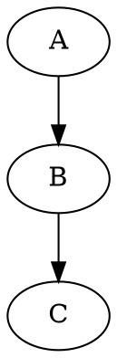
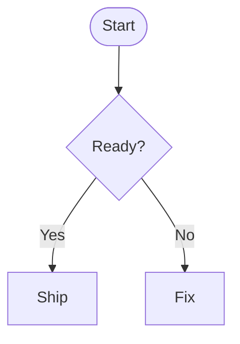
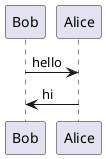
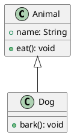
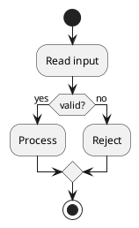

# Feature 示例库

本页从各个 Feature 包的 `src/examples.ts` 自动聚合，当前包含 **21 个 Feature**、**33 个示例**。

这些示例展示的是 Markdown 输入本身；完整实时预览请打开 [首页预览](/preview/?feature=mermaid)，或运行 `bun run feature:preview:web`。

## 目录

- [Admonition](#admonition) (1)
- [Card Vison](#card-vison) (2)
- [Code Highlight](#code-highlight) (1)
- [Code Highlight Preset DEV](#code-highlight-preset-dev) (1)
- [Code Highlight Preset Docs](#code-highlight-preset-docs) (1)
- [Code Highlight Preset Full](#code-highlight-preset-full) (1)
- [Core Markdown](#core-markdown) (4)
- [D2](#d2) (3)
- [Definition List](#definition-list) (1)
- [Diagram DOT](#diagram-dot) (1)
- [Diagram Echarts](#diagram-echarts) (1)
- [Diagram Vega Lite](#diagram-vega-lite) (1)
- [Emoji](#emoji) (1)
- [Footnote](#footnote) (1)
- [GFM](#gfm) (1)
- [Html Page](#html-page) (1)
- [MAP](#map) (2)
- [Math](#math) (1)
- [Mermaid](#mermaid) (1)
- [Plantuml](#plantuml) (3)
- [Weather](#weather) (4)

## Admonition

包：`@supramark/feature-admonition`  
路径：`packages/features/containers/admonition`

### 提示框（Admonition）

展示 ::: note / ::: warning 等容器块的解析与渲染效果。

```markdown
# 提示框示例

::: note 提示
这是一个普通提示框，用于展示一般性说明。
:::

::: warning 警告
请勿在生产环境中直接使用测试密钥。
:::
```

## Card Vison

包：`@supramark/feature-card-vison`  
路径：`packages/features/cards/vison`

### Hello card

Minimal Vison card with a single text block.

```markdown
:::vison
{
"version": "1",
"type": "container",
"style": {
"padding": 12,
"backgroundColor": "#F5F5F5",
"borderRadius": 8
},
"children": [
{
"type": "text",
"props": {
"text": "Hello Vison"
},
"style": {
"fontSize": 16,
"fontWeight": "bold"
}
}
]
}
:::
```

### AI assistant card

Realistic AI chat assistant card with avatar, divider, markdown body, and image.

```markdown
:::vison
{
"version": "1",
"type": "container",
"style": {
"padding": 16,
"backgroundColor": "#FFFFFF",
"borderRadius": 12,
"width": 340,
"gap": 12,
"borderWidth": 1,
"borderColor": "#E5E5E5"
},
"children": [
{
"type": "container",
"style": {
"flexDirection": "row",
"alignItems": "center",
"gap": 8
},
"children": [
{
"type": "image",
"props": {
"src": "https://api.dicebear.com/7.x/bottts/svg?seed=vison",
"width": 40,
"aspectRatio": 1
},
"style": {
"borderRadius": 20,
"width": 40,
"height": 40
}
},
{
"type": "text",
"props": {
"text": "Vison Assistant"
},
"style": {
"fontSize": 16,
"fontWeight": "600",
"color": "#1A1A1A"
}
}
]
},
{
"type": "divider",
"style": {
"margin": 4,
"borderColor": "#F0F0F0"
}
},
{
"type": "markdown",
"props": {
"content": "### Deployment report\nService is live. Highlights:\n- **Performance**: +20%\n- **Security**: XSS hotfix shipped"
},
"style": {
"fontSize": 14,
"color": "#4A4A4A"
}
}
]
}
:::
```

## Code Highlight

包：`@supramark/feature-code-highlight`  
路径：`packages/features/main/code-highlight`

### TypeScript code fence

A normal code fence that can be highlighted when language assets are compiled.

````markdown
```ts
const message: string = 'hello';
```
````

## Code Highlight Preset DEV

包：`@supramark/feature-code-highlight-preset-dev`  
路径：`packages/features/main/code-highlight-preset-dev`

### Dev preset

Highlights common engineering snippets.

````markdown
```rust
fn main() { println!("hi"); }
```
````

## Code Highlight Preset Docs

包：`@supramark/feature-code-highlight-preset-docs`  
路径：`packages/features/main/code-highlight-preset-docs`

### Docs preset

Highlights common documentation and config snippets.

````markdown
```json
{ "name": "supramark" }
```
````

## Code Highlight Preset Full

包：`@supramark/feature-code-highlight-preset-full`  
路径：`packages/features/main/code-highlight-preset-full`

### Full preset

Requests the full two_face language and theme assets.

````markdown
```zig
const std = @import("std");
```
````

## Core Markdown

包：`@supramark/feature-core-markdown`  
路径：`packages/features/core-markdown`

### 基础文本 / 段落

展示最基础的段落与换行渲染效果。

```markdown
# supramark 示例

这是一个基础示例，用来演示多行文本、段落之间的间距等。

你可以切换不同类型的示例来查看更多功能。
```

### 标题层级

展示 H1-H4 的渲染样式。

```markdown
# 一级标题 H1

一些说明文字。

## 二级标题 H2

更多说明。

### 三级标题 H3

再多一点说明。

#### 四级标题 H4

最后一段说明。
```

### 列表

展示无序和有序列表。

```markdown
# 列表示例

- 无序列表项 1
- 无序列表项 2

1. 有序列表项 1
2. 有序列表项 2
```

### 代码块

展示普通代码块的渲染效果。

````markdown
# 代码块示例

下面是一段 JavaScript 代码：

```js
function hello(name) {
  console.log('Hello, ' + name);
}

hello('supramark');
```
````

## D2

包：`@supramark/feature-d2`  
路径：`packages/features/diagrams/d2`

### 最简流程

使用 ```d2 围栏定义一条最小的节点连线。

````markdown
# D2 minimal flow

```d2
a -> b
```
````

### 带标签连线

展示 D2 连线标签语法。

````markdown
# D2 labeled edges

```d2
user -> database: reads
database -> user: rows
```
````

### 容器 / 分组

展示 D2 的容器（container）语法，把多个节点组织为一个子图。

````markdown
# D2 container

```d2
customers: {
  alice
  bob
}
```
````

## Definition List

包：`@supramark/feature-definition-list`  
路径：`packages/features/main/definition-list`

### 定义列表（Definition List）

展示术语 + 多段描述的定义列表语法。

```markdown
# 定义列表示例

HTTP
: 一种应用层协议，用于超文本传输。
: 目前最常见的 Web 协议。

HTTPS
: 在 HTTP 之上加入 TLS 加密的安全协议。
```

## Diagram DOT

包：`@supramark/feature-diagram-dot`  
路径：`packages/features/diagrams/dot`

### 有向图示例

使用 ```dot 围栏代码块定义一个简单有向图。

````markdown
# DOT / Graphviz diagram 示例


````

## Diagram Echarts

包：`@supramark/feature-diagram-echarts`  
路径：`packages/features/diagrams/echarts`

### ECharts 折线图

使用 ```echarts 围栏代码块定义一个简单折线图 option。

````markdown
# ECharts diagram 示例

```echarts
{
  "xAxis": { "type": "category", "data": ["Mon", "Tue", "Wed"] },
  "yAxis": { "type": "value" },
  "series": [
    { "type": "line", "data": [150, 230, 224] }
  ]
}
```
````

## Diagram Vega Lite

包：`@supramark/feature-diagram-vega-lite`  
路径：`packages/features/diagrams/vega-lite`

### Vega-Lite 柱状图

使用 ```vega-lite 围栏代码块定义一个最小可用的 Vega-Lite 柱状图。

````markdown
# Vega-Lite diagram 示例

下面的围栏代码块会被 supramark 识别为 `diagram` 节点（engine = "vega-lite"）：

```vega-lite
{
  "mark": "bar",
  "encoding": {
    "x": { "field": "category", "type": "ordinal" },
    "y": { "field": "value", "type": "quantitative" }
  },
  "data": {
    "values": [
      { "category": "A", "value": 1 },
      { "category": "B", "value": 2 }
    ]
  }
}
```
````

## Emoji

包：`@supramark/feature-emoji`  
路径：`packages/features/main/emoji`

### Emoji / 短代码

展示 :smile: / :rocket: 等 Emoji 短代码的解析效果。

```markdown
# Emoji 示例

支持 GitHub 风格短代码：

- :smile: :joy: :wink:
- :rocket: :tada: :warning:

也可以直接输入原生 Emoji 😄🚀🎉。
```

## Footnote

包：`@supramark/feature-footnote`  
路径：`packages/features/main/footnote`

### 脚注（Footnote）

展示脚注的引用和定义语法。

```markdown
# 脚注示例

这是一段包含脚注的文本[^1]。你可以在同一段落中添加多个脚注[^2]。

脚注可以让你添加补充说明而不打断正文流程[^note]。

[^1]: 这是第一个脚注的内容。

[^2]: 这是第二个脚注，可以包含更详细的解释。

[^note]: 脚注标识符可以是数字或文本。
```

## GFM

包：`@supramark/feature-gfm`  
路径：`packages/features/main/gfm`

### GFM 扩展功能

展示 GitHub Flavored Markdown 扩展功能，如删除线、任务列表、表格。

```markdown
# GFM 功能示例

## 删除线

使用 `~~文本~~` 语法来创建~~删除线~~效果。

例如：这是一段~~错误的~~正确的文本。

## 任务列表

使用 `- [ ]` 和 `- [x]` 来创建任务列表：

- [x] 已完成的任务
- [ ] 未完成的任务
- [x] 另一个已完成的任务
- [ ] 待办事项

## 组合使用

你可以将删除线与其他格式组合使用：

- **粗体**和~~删除线~~
- *斜体*和~~删除线~~
- `代码`和~~删除线~~

~~**整段粗体删除线**~~

## 表格

使用 GFM 表格语法创建表格，支持列对齐：

| 功能     | 状态 |                 说明 |
| -------- | :--: | -------------------: |
| 删除线   |  ✅  |       使用 `~~` 语法 |
| 任务列表 |  ✅  |  使用 `[ ]` 和 `[x]` |
| 表格     |  ✅  |        标准 GFM 表格 |
| 对齐方式 |  ✅  | 左对齐、居中、右对齐 |
```

## Html Page

包：`@supramark/feature-html-page`  
路径：`packages/features/containers/html-page`

### HTML Page 卡片

使用 :::html 容器定义独立 HTML 页面，在 Markdown 中以卡片形式呈现。

```markdown
# HTML Page 示例

下面的容器会被识别为一个 html_page 节点，并在主文档中渲染为「HTML Page 卡片」：

:::html

<!doctype html>
<html>
  <head>
    <meta charset="utf-8" />
    <title>HTML Page 示例</title>
    <style>
      body { font-family: -apple-system, BlinkMacSystemFont, sans-serif; padding: 24px; }
      h1 { color: #2f54eb; }
      p { line-height: 1.6; }
    </style>
  </head>
  <body>
    <h1>这是一个独立 HTML 页面</h1>
    <p>它可以包含自己的 CSS 和 JS，在宿主提供的隔离页面或 ShadowDOM 容器中单独运行。</p>
  </body>
</html>
:::
```

## MAP

包：`@supramark/feature-map`  
路径：`packages/features/containers/map`

### 基本地图卡片

使用 :::map 定义一个带中心点与标记点的地图卡片。

```markdown
# 地图示例（Map）

下面的容器会被识别为一个 map 节点，并在主文档中渲染为「地图卡片」：

:::map
center: [34.05, -118.24]
zoom: 12
marker:
lat: 34.05
lng: -118.24
:::
```

### 仅指定中心点的地图

只提供 center，不指定 marker，用于展示某个区域概览。

```markdown
:::map
center: [31.2304, 121.4737]
zoom: 10
:::
```

## Math

包：`@supramark/feature-math`  
路径：`packages/features/main/math`

### 数学公式（Math / LaTeX）

展示行内 `$...$` 与块级 `$$...$$` 数学公式的 AST 与基础渲染效果。

```markdown
# 数学公式示例

supramark 会识别行内公式 $E = mc^2$，并在 AST 中生成 `math_inline` 节点。

下面是一个块级公式（`math_block`）：

$$
\frac{1}{\sqrt{2\pi\sigma^2}} e^{-\frac{(x - \mu)^2}{2\sigma^2}}
$$

当前阶段，这些公式会以「代码样式的 TeX 文本」渲染，后续会通过 KaTeX 等方式升级为真正的公式渲染。
```

## Mermaid

包：`@supramark/feature-mermaid`  
路径：`packages/features/diagrams/mermaid`

### 流程图示例

使用 ```mermaid 围栏代码块定义一个简单流程图。

````markdown
# Mermaid diagram 示例


````

## Plantuml

包：`@supramark/feature-plantuml`  
路径：`packages/features/diagrams/plantuml`

### 时序图示例

使用 ```plantuml 围栏定义一个最小的时序图。

````markdown
# PlantUML sequence diagram


````

### 类图示例

展示 PlantUML 类图语法。

````markdown
# PlantUML class diagram


````

### 活动图示例

展示 PlantUML 活动图语法。

````markdown
# PlantUML activity diagram


````

## Weather

包：`@supramark/feature-weather`  
路径：`packages/features/containers/weather`

### 天气卡片 - YAML 格式

使用 YAML 格式配置天气卡片（默认格式）

```markdown
:::weather yaml
location: Beijing
units: metric
:::
```

### 天气卡片 - JSON 格式

使用 JSON 格式配置天气卡片

```markdown
:::weather json
{
"location": "Tokyo",
"units": "metric"
}
:::
```

### 天气卡片 - TOON 格式

使用 TOON 紧凑表格式格式配置天气卡片

```markdown
:::weather toon
location: London
units: imperial
:::
```

### 多个天气卡片

展示不同城市的天气

```markdown
:::weather yaml
location: New York
units: imperial
:::

:::weather yaml
location: Paris
units: metric
:::

:::weather yaml
location: Sydney
units: metric
:::
```

---

_此文档由 scripts/doc-gen-example.ts 自动生成_
