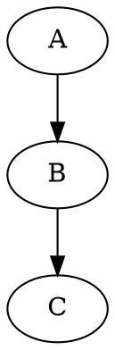
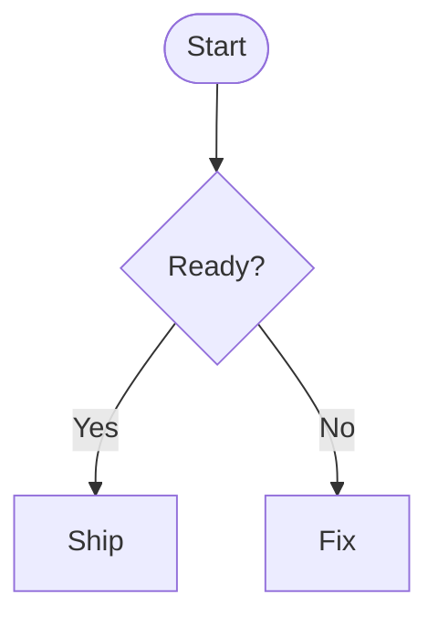
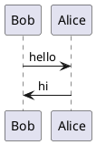
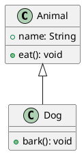
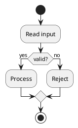

# Feature Example Gallery

This page is automatically aggregated from each Feature package's `src/examples.ts`, currently covering **22 Features** and **34 examples**.

These examples show the raw Markdown input; for the full live preview, open the [homepage preview](/preview/?feature=mermaid) or run `bun run feature:preview:web`.

## Table of Contents

- [Admonition](#admonition) (1)
- [Card Vison](#card-vison) (2)
- [Code Highlight](#code-highlight) (1)
- [Code Highlight Preset DEV](#code-highlight-preset-dev) (1)
- [Code Highlight Preset Docs](#code-highlight-preset-docs) (1)
- [Code Highlight Preset Full](#code-highlight-preset-full) (1)
- [Core Markdown](#core-markdown) (4)
- [D2](#d2) (3)
- [Definition List](#definition-list) (1)
- [Diagram DOT](#diagram-dot) (1)
- [Diagram Echarts](#diagram-echarts) (1)
- [Diagram Vega Lite](#diagram-vega-lite) (1)
- [Emoji](#emoji) (1)
- [Footnote](#footnote) (1)
- [GFM](#gfm) (1)
- [Html Page](#html-page) (1)
- [MAP](#map) (2)
- [Math](#math) (1)
- [Mermaid](#mermaid) (1)
- [Plantuml](#plantuml) (3)
- [Weather](#weather) (4)
- [Wikilink](#wikilink) (1)

## Admonition

Package: `@supramark/feature-admonition`  
Path: `packages/features/containers/admonition`

### Tip box (Admonition)

Shows parsing and rendering of ::: note / ::: warning etc. container blocks.

```markdown
# Tip box example

::: note Tip
This is a plain tip box, used for general-purpose notes.
:::

::: warning Warning
Do not use test keys directly in production.
:::
```

## Card Vison

Package: `@supramark/feature-card-vison`  
Path: `packages/features/cards/vison`

### Hello card

Minimal Vison card with a single text block.

```markdown
:::vison
{
  "version": "1",
  "type": "container",
  "style": {
    "padding": 12,
    "backgroundColor": "#F5F5F5",
    "borderRadius": 8
  },
  "children": [
    {
      "type": "text",
      "props": {
        "text": "Hello Vison"
      },
      "style": {
        "fontSize": 16,
        "fontWeight": "bold"
      }
    }
  ]
}
:::
```

### AI assistant card

Realistic AI chat assistant card with avatar, divider, markdown body, and image.

```markdown
:::vison
{
  "version": "1",
  "type": "container",
  "style": {
    "padding": 16,
    "backgroundColor": "#FFFFFF",
    "borderRadius": 12,
    "width": 340,
    "gap": 12,
    "borderWidth": 1,
    "borderColor": "#E5E5E5"
  },
  "children": [
    {
      "type": "container",
      "style": {
        "flexDirection": "row",
        "alignItems": "center",
        "gap": 8
      },
      "children": [
        {
          "type": "image",
          "props": {
            "src": "https://api.dicebear.com/7.x/bottts/svg?seed=vison",
            "width": 40,
            "aspectRatio": 1
          },
          "style": {
            "borderRadius": 20,
            "width": 40,
            "height": 40
          }
        },
        {
          "type": "text",
          "props": {
            "text": "Vison Assistant"
          },
          "style": {
            "fontSize": 16,
            "fontWeight": "600",
            "color": "#1A1A1A"
          }
        }
      ]
    },
    {
      "type": "divider",
      "style": {
        "margin": 4,
        "borderColor": "#F0F0F0"
      }
    },
    {
      "type": "markdown",
      "props": {
        "content": "### Deployment report\nService is live. Highlights:\n- **Performance**: +20%\n- **Security**: XSS hotfix shipped"
      },
      "style": {
        "fontSize": 14,
        "color": "#4A4A4A"
      }
    }
  ]
}
:::
```

## Code Highlight

Package: `@supramark/feature-code-highlight`  
Path: `packages/features/main/code-highlight`

### TypeScript code fence

A normal code fence that can be highlighted when language assets are compiled.

````markdown
```ts
const message: string = "hello";
```
````

## Code Highlight Preset DEV

Package: `@supramark/feature-code-highlight-preset-dev`  
Path: `packages/features/main/code-highlight-preset-dev`

### Dev preset

Highlights common engineering snippets.

````markdown
```rust
fn main() { println!("hi"); }
```
````

## Code Highlight Preset Docs

Package: `@supramark/feature-code-highlight-preset-docs`  
Path: `packages/features/main/code-highlight-preset-docs`

### Docs preset

Highlights common documentation and config snippets.

````markdown
```json
{ "name": "supramark" }
```
````

## Code Highlight Preset Full

Package: `@supramark/feature-code-highlight-preset-full`  
Path: `packages/features/main/code-highlight-preset-full`

### Full preset

Requests the full two_face language and theme assets.

````markdown
```zig
const std = @import("std");
```
````

## Core Markdown

Package: `@supramark/feature-core-markdown`  
Path: `packages/features/core-markdown`

### Basic text / paragraphs

Shows the most basic paragraph and line-break rendering.

```markdown
# supramark example

This is a basic example demonstrating multi-line text, spacing between paragraphs, etc.

You can switch between different example types to see more features.
```

### Heading levels

Shows the rendering style of H1-H4.

```markdown
# Level-1 heading H1

Some explanatory text.

## Level-2 heading H2

More explanation.

### Level-3 heading H3

Even more explanation.

#### Level-4 heading H4

The last bit of explanation.
```

### Lists

Shows unordered and ordered lists.

```markdown
# List example

- Unordered list item 1
- Unordered list item 2

1. Ordered list item 1
2. Ordered list item 2
```

### Code block

Shows the rendering of a plain code block.

````markdown
# Code block example

Here is a snippet of JavaScript code:

```js
function hello(name) {
  console.log('Hello, ' + name)
}

hello('supramark')
```
````

## D2

Package: `@supramark/feature-d2`  
Path: `packages/features/diagrams/d2`

### Minimal flow

Uses a ```d2 fence to define the simplest possible node edge.

````markdown
# D2 minimal flow

```d2
a -> b
```
````

### Labeled edge

Shows D2 edge label syntax.

````markdown
# D2 labeled edges

```d2
user -> database: reads
database -> user: rows
```
````

### Container / grouping

Shows D2 container syntax, grouping multiple nodes into a subgraph.

````markdown
# D2 container

```d2
customers: {
  alice
  bob
}
```
````

## Definition List

Package: `@supramark/feature-definition-list`  
Path: `packages/features/main/definition-list`

### Definition List

Shows the term + multi-paragraph description syntax for definition lists.

```markdown
# Definition List Example

HTTP
:   An application-layer protocol used for hypertext transfer.
:   Currently the most common Web protocol.

HTTPS
:   A secure protocol that adds TLS encryption on top of HTTP.
```

## Diagram DOT

Package: `@supramark/feature-diagram-dot`  
Path: `packages/features/diagrams/dot`

### Directed graph example

Uses a ```dot fenced code block to define a simple directed graph.

````markdown
# DOT / Graphviz diagram example


```dot
digraph G {
  A -> B;
  B -> C;
}
```
````

## Diagram Echarts

Package: `@supramark/feature-diagram-echarts`  
Path: `packages/features/diagrams/echarts`

### ECharts line chart

Uses a ```echarts fenced code block to define a simple line-chart option.

````markdown
# ECharts diagram example

```echarts
{
  "xAxis": { "type": "category", "data": ["Mon", "Tue", "Wed"] },
  "yAxis": { "type": "value" },
  "series": [
    { "type": "line", "data": [150, 230, 224] }
  ]
}
```
````

## Diagram Vega Lite

Package: `@supramark/feature-diagram-vega-lite`  
Path: `packages/features/diagrams/vega-lite`

### Vega-Lite bar chart

Uses a ```vega-lite fenced code block to define a minimal working Vega-Lite bar chart.

````markdown
# Vega-Lite diagram example

The fenced code block below is recognized by supramark as a `diagram` node (engine = "vega-lite"):

```vega-lite
{
  "mark": "bar",
  "encoding": {
    "x": { "field": "category", "type": "ordinal" },
    "y": { "field": "value", "type": "quantitative" }
  },
  "data": {
    "values": [
      { "category": "A", "value": 1 },
      { "category": "B", "value": 2 }
    ]
  }
}
```
````

## Emoji

Package: `@supramark/feature-emoji`  
Path: `packages/features/main/emoji`

### Emoji / shortcode

Shows how Emoji shortcodes such as :smile: / :rocket: are parsed.

```markdown
# Emoji Example

GitHub-style shortcodes are supported:

- :smile: :joy: :wink:
- :rocket: :tada: :warning:

Native Emoji characters 😄🚀🎉 can also be typed directly.
```

## Footnote

Package: `@supramark/feature-footnote`  
Path: `packages/features/main/footnote`

### Footnote

Shows the reference and definition syntax for footnotes.

```markdown
# Footnote Example

This is a paragraph of text with a footnote[^1]. You can add multiple footnotes in the same paragraph[^2].

Footnotes let you add supplementary notes without interrupting the flow of the main text[^note].

[^1]: This is the content of the first footnote.

[^2]: This is the second footnote, which can contain a more detailed explanation.

[^note]: A footnote identifier can be a number or text.
```

## GFM

Package: `@supramark/feature-gfm`  
Path: `packages/features/main/gfm`

### GFM extensions

Shows GitHub Flavored Markdown extensions such as strikethrough, task lists, and tables.

```markdown
# GFM feature examples

## Strikethrough

Use the `~~text~~` syntax to create ~~strikethrough~~ text.

For example: this is a piece of ~~wrong~~ correct text.

## Task lists

Use `- [ ]` and `- [x]` to create a task list:

- [x] Completed task
- [ ] Incomplete task
- [x] Another completed task
- [ ] A to-do item

## Combining formats

You can combine strikethrough with other formatting:

- **bold** and ~~strikethrough~~
- *italic* and ~~strikethrough~~
- `code` and ~~strikethrough~~

~~**Bold strikethrough for a whole sentence**~~

## Tables

Use GFM table syntax to create tables, with support for column alignment:

| Feature | Status | Notes |
| --- | :---: | ---: |
| Strikethrough | ✅ | Uses `~~` syntax |
| Task list | ✅ | Uses `[ ]` and `[x]` |
| Table | ✅ | Standard GFM table |
| Alignment | ✅ | Left, center, right |
```

## Html Page

Package: `@supramark/feature-html-page`  
Path: `packages/features/containers/html-page`

### HTML Page card

Defines a standalone HTML page using the :::html container, rendered as a card in Markdown.

```markdown
# HTML Page example

The container below is recognized as an html_page node, and rendered in the main document as an "HTML Page card":

:::html
<!doctype html>
<html>
  <head>
    <meta charset="utf-8" />
    <title>HTML Page example</title>
    <style>
      body { font-family: -apple-system, BlinkMacSystemFont, sans-serif; padding: 24px; }
      h1 { color: #2f54eb; }
      p { line-height: 1.6; }
    </style>
  </head>
  <body>
    <h1>This is a standalone HTML page</h1>
    <p>It can include its own CSS and JS, running independently inside an isolated page or ShadowDOM container provided by the host.</p>
  </body>
</html>
:::
```

## MAP

Package: `@supramark/feature-map`  
Path: `packages/features/containers/map`

### Basic map card

Use :::map to define a map card with a center point and a marker.

```markdown
# Map example

The container below is recognized as a map node and rendered as a "map card" in the main document:

:::map
center: [34.05, -118.24]
zoom: 12
marker:
  lat: 34.05
  lng: -118.24
:::
```

### Map with only a center point

Provide only center, without a marker, to show an overview of an area.

```markdown
:::map
center: [31.2304, 121.4737]
zoom: 10
:::
```

## Math

Package: `@supramark/feature-math`  
Path: `packages/features/main/math`

### Math formulas (Math / LaTeX)

Shows the AST and basic rendering of inline `$...$` and block `$$...$$` math formulas.

```markdown
# Math Formula Example

supramark recognizes the inline formula $E = mc^2$ and generates a `math_inline` node in the AST.

Below is a block formula (`math_block`):

$$
\frac{1}{\sqrt{2\pi\sigma^2}} e^{-\frac{(x - \mu)^2}{2\sigma^2}}
$$

At the current stage, these formulas are rendered as "code-styled TeX text"; they will later be upgraded to real formula rendering via KaTeX and similar tools.
```

## Mermaid

Package: `@supramark/feature-mermaid`  
Path: `packages/features/diagrams/mermaid`

### Flowchart example

Uses a ```mermaid fenced code block to define a simple flowchart.

````markdown
# Mermaid diagram example


```mermaid
graph TD
  Start([Start]) --> Check{Ready?}
  Check -->|Yes| Ship[Ship]
  Check -->|No| Fix[Fix]
```
````

## Plantuml

Package: `@supramark/feature-plantuml`  
Path: `packages/features/diagrams/plantuml`

### Sequence diagram example

Uses a ```plantuml fence to define a minimal sequence diagram.

````markdown
# PlantUML sequence diagram


```plantuml
@startuml
Bob -> Alice : hello
Alice -> Bob : hi
@enduml
```
````

### Class diagram example

Shows PlantUML class diagram syntax.

````markdown
# PlantUML class diagram


```plantuml
@startuml
class Animal {
  +name: String
  +eat(): void
}
class Dog extends Animal {
  +bark(): void
}
@enduml
```
````

### Activity diagram example

Shows PlantUML activity diagram syntax.

````markdown
# PlantUML activity diagram


```plantuml
@startuml
start
:Read input;
if (valid?) then (yes)
  :Process;
else (no)
  :Reject;
endif
stop
@enduml
```
````

## Weather

Package: `@supramark/feature-weather`  
Path: `packages/features/containers/weather`

### Weather card - YAML format

Configure a weather card using YAML format (the default)

```markdown
:::weather yaml
location: Beijing
units: metric
:::
```

### Weather card - JSON format

Configure a weather card using JSON format

```markdown
:::weather json
{
  "location": "Tokyo",
  "units": "metric"
}
:::
```

### Weather card - TOON format

Configure a weather card using the compact TOON tabular format

```markdown
:::weather toon
location: London
units: imperial
:::
```

### Multiple weather cards

Show weather for several cities

```markdown
:::weather yaml
location: New York
units: imperial
:::

:::weather yaml
location: Paris
units: metric
:::

:::weather yaml
location: Sydney
units: metric
:::
```

## Wikilink

Package: `@supramark/feature-wikilink`  
Path: `packages/features/main/wikilink`

### WikiLink

Shows the [[target]], [[target|label]] and [[target#section]] syntax.

```markdown
# WikiLink Example

A plain wikilink: [[Project Plan]].

With a display label: [[Project Plan|the plan]].

With a heading fragment: [[Project Plan#Roadmap]], and both together:
[[Project Plan#Roadmap|the roadmap]].

Same-page fragment: [[#Q2-goals]].

Malformed forms degrade to literal text: [[]] and [[unclosed stay as-is.
```

---
*This document is auto-generated by scripts/doc-gen-example.ts*
