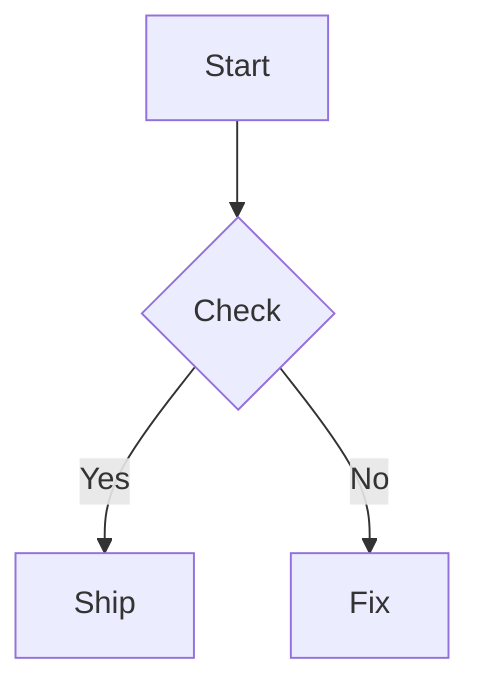

# Mermaid Feature

Mermaid 图表支持 Feature。

- 语法：使用围栏代码块：

````markdown

````

- AST：统一解析为 `diagram` 节点，`engine` 为 `mermaid`。
- 渲染：
  - **Web**：`@supramark/engines` 调用 `@actrium/mermaid-little-web`（Rust → wasm）输出 SVG，零 DOM / 零 headless 浏览器 / 零 upstream JS Mermaid bundle。
  - **RN**：宿主在启动时导入 `@actrium/supramark-mermaid-native-rn`，由 side-effect 注册 `mermaid-little` native FFI adapter；最终同样返回 SVG 字符串并交给 `react-native-svg` 显示。

本包当前主要用于：

- 在 FeatureRegistry 中声明「Mermaid 图表」能力；
- 通过 `createMermaidFeatureConfig()` 为运行时配置提供强类型入口；
- 让 Web / RN 的 diagram gating 能和其它 family 使用同一套规则。
